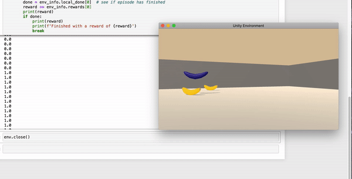
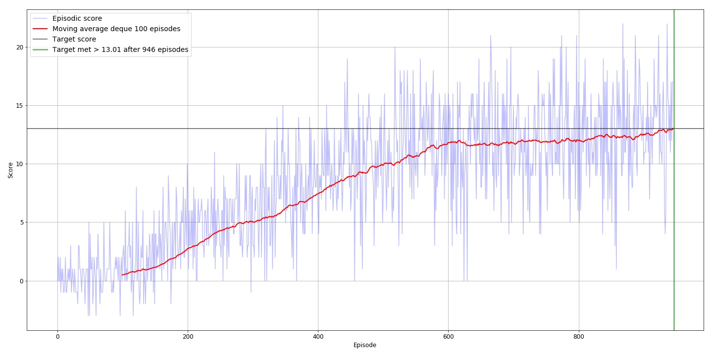
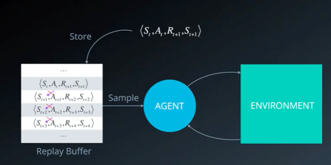
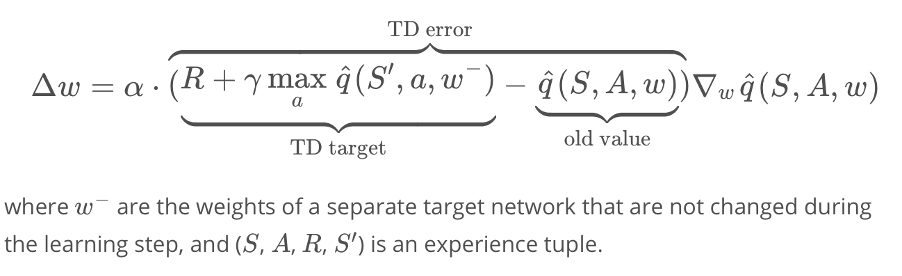
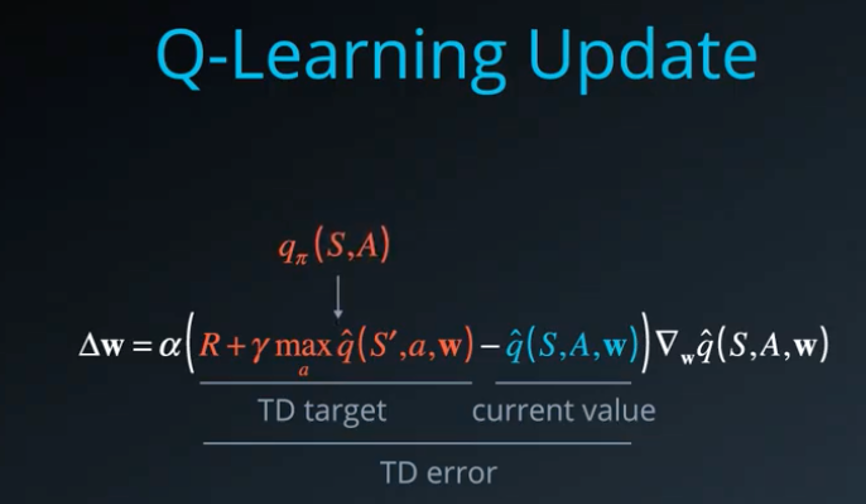
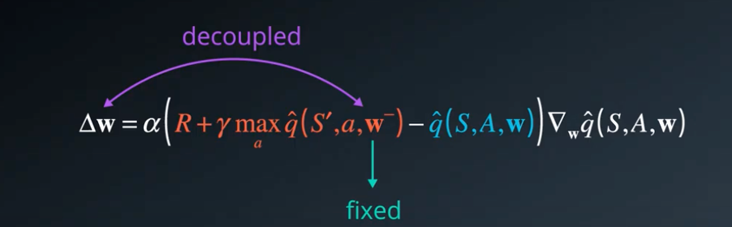

# Deep Reinforcement Learning Robot: Navigation
Deep Reinforcement Learning nano degree

Quick start:

To run train this model you will need the below key elements:

1. [Install AI gym dependencies](https://github.com/udacity/deep-reinforcement-learning#dependencies)
2. [Install Unity environment](https://github.com/udacity/deep-reinforcement-learning#dependencies)
  Linux: https://s3-us-west-1.amazonaws.com/udacity-drlnd/P1/Banana/Banana_Linux.zip
  
Mac OSX: https://s3-us-west-1.amazonaws.com/udacity-drlnd/P1/Banana/Banana.app.zip

Windows (32-bit): https://s3-us-west-1.amazonaws.com/udacity-drlnd/P1/Banana/Banana_Windows_x86.zip

Windows (64-bit): https://s3-us-west-1.amazonaws.com/udacity-drlnd/P1/Banana/Banana_Windows_x86_64.zip

  Then, place unity the file in the p1_navigation/ folder in the DRLND GitHub repository from part 1, and unzip (or decompress) the file.

[Navigation notebook](https://github.com/Pytrader1x/DeepReinforcementLearning/blob/master/Optimal_DQN_Navigation.ipynb)

[Model](https://github.com/Pytrader1x/DeepReinforcementLearning/blob/master/model.py)

[DQN Agent](https://github.com/Pytrader1x/DeepReinforcementLearning/blob/master/dqn_agent.py)

Objective:

Train a bot using Q learning to collect as many yellow bananas while avoiding blue bananas.

We consider the problem solved when the moving average of the last 100 episodes is >= 13.01

## Completed Jupyter notebook report:
https://github.com/Pytrader1x/DeepReinforcementLearning/blob/master/Navigation-DQN.pdf

## After training we get a robot that scores > 13 after 946 episodes

# Environment description:

# Deep Q learning:
Experience Replay:

A good way to make more efficient use of observed experiences. 

Basic Online Q learning algorithm where we interact with the environment and at each time step we get a state action reward tuple and learn from the it. Then its discarded.

However with Experience replay the SARSA Experiences are recorded so that we can at random re select them so that rare occurrences can play a greater role in training the network while also preventing oscillations or catastrophic divergences as the model will now not rely on the relationships between the correlation between episodes of the SARSA tuples.

We want our RL agent to focus on exploring the Action state space fully by employing an Epsilon greedy approach. Then once fully explored we can focus on training.

When the agent interacts with the environment, the sequence of experience tuples can be highly correlated. The naive Q-learning algorithm that learns from each of these experience tuples in sequential order runs the risk of getting swayed by the effects of this correlation. By instead keeping track of a replay buffer and using experience replay to sample from the buffer at random, we can prevent action values from oscillating or diverging catastrophically.
The replay buffer contains a collection of experience tuples (SS, AA, RR, S′S′). The tuples are gradually added to the buffer as we are interacting with the environment.
The act of sampling a small batch of tuples from the replay buffer in order to learn is known as experience replay. In addition to breaking harmful correlations, experience replay allows us to learn more from individual tuples multiple times, recall rare occurrences, and in general make better use of our experience.

Fixed Q targets:

Summary
 
In Q-Learning, we update a guess with a guess, and this can potentially lead to harmful correlations. To avoid this, we can update the parameters w in the network q^ to better approximate the action value corresponding to state S and action A with the following update rule:

The goal is to reduce the error between this TD Target and the currently predicted Q value, this is called the TD Error.

The target here is thought to be the replacement for the true value function Q Π which is unknown to us.

We originally used Q Π to define a squared error loss and differentiated that with respect to W.

Here we set the fixed value of W- as a fixed copy of W that we don’t change during the learning step, in practice we use w – to generate targets while changing w for a certain number of learning steps. Then we update W- for the latest W, again we learn for a number of steps and so on.

This decouples the target from the parameters and makes the learning algorithm more stable.

Double Q learning:

To make our estimation of Q more robust we can use Double Q learning. Select the best action using one set of parameters W , but evaluate it using a different Parameters W’.

Its basically like having two separate function approximators that must agree on the best action.

If W picks an action that is not best according to W’ then the Q value returned is not that High.
In the long run this prevents the algorithm from propagating incidental higher rewards, that may have been obtained by chance and don’t reflect long term returns.

Where do we get the second set of parameters W’ from, when we do fixed target Q learning with W-, which stays frozen for a certain period of time it is thus sufficiently different from W that it can be re used for this purpose.

Overall double Q learning helps prevent the Q values from Exploding early on or fluctuating later on. As such Double DQN performs significantly better than vanilla DQN’s.

The environment is based on Unity ML-agents

The Unity Machine Learning Agents Toolkit (ML-Agents) is an open-source Unity plugin that enables games and simulations to serve as environments for training intelligent agents. Agents can be trained using reinforcement learning, imitation learning, neuroevolution, or other machine learning methods through a simple-to-use Python API.

A reward of +1 is provided for getting a yellow banana, and a reward of -1 is provided for getting a blue banana. Ergo, the objective is to maximise the collection of yellow banana's while minimizing blue ones.

The state space has 37 dimensions and contains the agent's velocity, along with ray-based perception of objects around the agent's forward direction.

Given this information, the agent has to learn how to best select actions. Four discrete actions are available, corresponding to:

0 - move forward.
1 - move backward.
2 - turn left.
3 - turn right.

The task is episodic, and in order to solve the environment, the agent must get an average score of +13 over 100 consecutive episodes.

Getting started

## Installation requirements

You first need to configure a Python 3.6 / PyTorch 0.4.0 environment with the needed requirements as described in the Udacity repository

Of course you have to clone this project and have it accessible in your Python environment

Then you have to install the Unity environment as described in the Getting Started section (The Unity ML-agant environment is already configured by Udacity)

Download the environment from one of the links below. You need only select the environment that matches your operating system:

Linux: click here
Mac OSX: click here
Windows (32-bit): click here
Windows (64-bit): click here
(For Windows users) Check out this link if you need help with determining if your computer is running a 32-bit version or 64-bit version of the Windows operating system.

(For AWS) If you'd like to train the agent on AWS (and have not enabled a virtual screen), then please use this link to obtain the environment.

Finally, unzip the environment archive in the 'project's environment' directory and eventually adjust thr path to the UnityEnvironment in the code.

# Train a agent

Execute the provided notebook within this Nanodegree Udacity Online Workspace for "Optimal_DQN_Navigation.ipynb" (or build your own local environment and make necessary adjustements for the path to the UnityEnvironment in the code )

Note :

Manually playing with the environment has not been implemented as it is not available with Udacity Online Worspace (No Virtual Screen)
Watching the trained agent playing in the environment has not been implemented neither, as it is not available with Udacity Online Worspace (No Virtual Screen) and not compatible with my personal setup (see Misc : Configuration used section)
Misc : Configuration used

# Future research:

Generalise the DQN with Double Q learning - in progress with DDQN agent
Optimise hyperparameterts to get to a reward of +20
