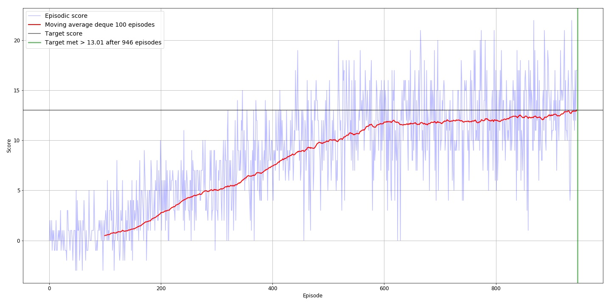

## Report
Reinforcement learning algorithm

The learning algorithm used is vanilla Deep Q Learning as described in original paper. 

The input is the vector of states as show below:

Deep RL DQN network structure is as follows:

- Fully connected layer - input: 37 (state size) output: 512
- Fully connected layer - input: 512 output 512
- Fully connected layer - input: 512 output: (action size)

Parameters used in DQN algorithm:
- Batch size of 128 to leverage GPU rather than 64

- Starting epsilion: 1.0

- Maximum steps per episode: 1000

- Ending epsilion: 0.01

- Epsilion decay rate: 0.995

- Max number of episodes = 2000
## Results

## Optimized DQN agent

